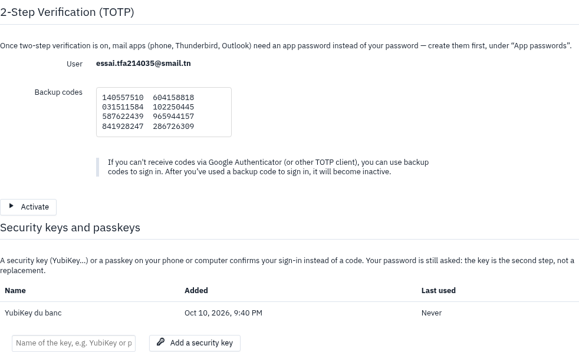
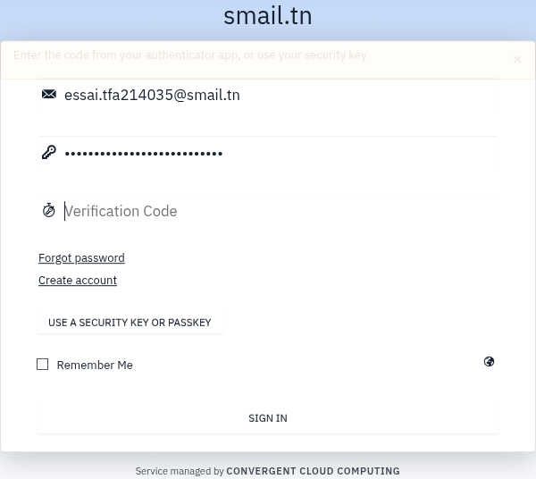

# Two Factor Authentication (two-factor-auth)

A second factor for SnappyMail logins: a **TOTP** code (any authenticator app),
**backup codes**, and since 2.28.0 **security keys and passkeys (WebAuthn)**.
Captures and how they are made: [`docs/captures/`](docs/captures/README.md).

## Security keys are a second factor, not a password replacement

SnappyMail opens the mailbox over IMAP **with the person's password**. A
passkey proves who is at the keyboard; it does not give the server that
password. Logging in with a passkey alone would need the server to keep every
password, or a master credential able to open any mailbox — both refused by
design. So the password comes first, then the code or the key.

## Settings (admin panel → plugin)

| Setting | Default | |
|---|---|---|
| `force_two_factor_auth`, `force_two_factor_domains` | off, empty | everyone / these domains must set up a second factor (held by the server since 2.27.0) |
| `webauthn_enabled` | off | security keys and passkeys |
| `webauthn_origins` | empty | the webmail origins, e.g. `https://webmail.example.com`; empty = keys off. The Host header is never trusted |
| `webauthn_rp_id` | host of the first origin | the domain keys are bound to; changing it voids every key |
| `webauthn_require_uv` | off | require a PIN or biometrics on the key |
| `webauthn_max_passkeys` | 10 | per account (1–50) |
| `webauthn_challenge_ttl` | 300 | seconds (30–3600); each challenge is used once |
| `webauthn_counter_regression` | refuse | `refuse` or `warn` when a key's signature counter goes back |

Verified on the server, without any third-party library
(`providers/webauthn.php`): ES256, RS256 (2048–4096 bits), EdDSA (Ed25519, with
sodium); attestation `none` and `packed` (the chain is not trusted, the
statement must verify); strict, bounded CBOR. Keys are stored in the account's
record, sealed with a key derived from `APP_SALT`.

## Tests

    php plugins/two-factor-auth/tests/WebAuthnTest.php   # the verifier, real authenticator vectors
    php plugins/two-factor-auth/tests/ActionsTest.php    # the plugin's actions
    php plugins/two-factor-auth/tests/RecordTest.php     # the stored record
    node --test plugins/two-factor-auth/tests/*.test.js  # the browser code, in node:vm
    BANC=cle sh plugins/two-factor-auth/tests/browser/preparer.sh   # banc-smail, CDP virtual authenticator
